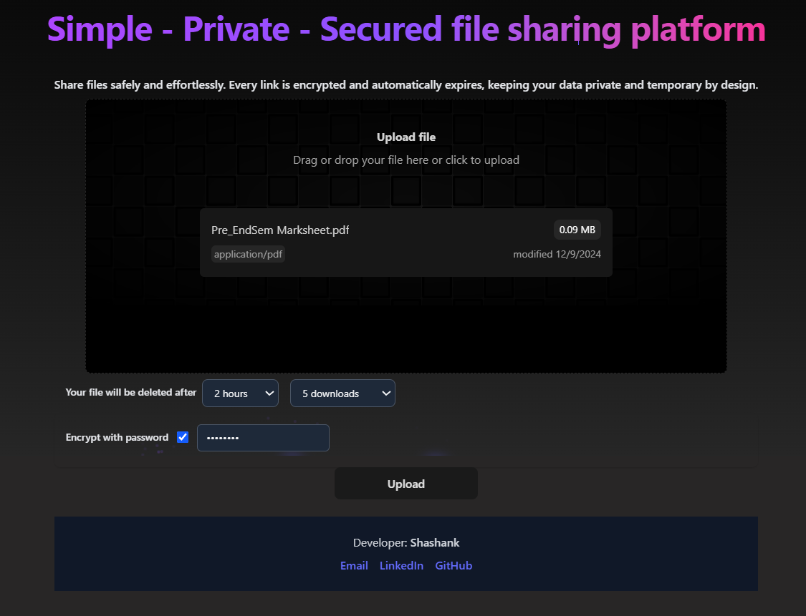
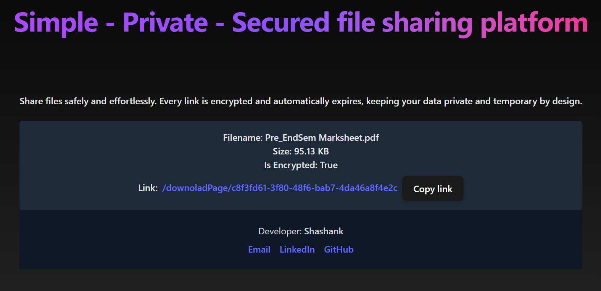
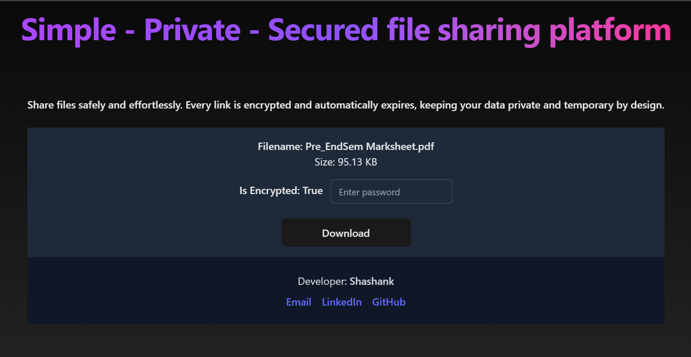

# QuickDrop

QuickDrop is a fast and secure file-sharing platform that lets you upload, encrypt, and share files through time-limited links.  
Your shared files stay private, and automatically expire after the set duration or download limit.

## Features

* Upload and share files securely  
* Optional password protection for extra privacy 
* Auto-expiring links based on duration or download count   
* Cloud-based storage (using Cloudinary)  
* Clean and modern UI built with React + Tailwind CSS  
* Easy link copying and simple file management  

## Tech Stack

| Layer | Technologies |
|-------|---------------|
| **Frontend** | React, Tailwind CSS, Framer Motion |
| **Backend** | Node.js, Express.js, Multer |
| **Database** | MongoDB |
| **File Storage** | Cloudinary |
| **Utilities** | UUID, dotenv, bcrypt |

## Preview

### Upload page (Home page)


### Link Share page (after uploading file)


### Download page



---

## ⚙️ Installation

Follow these steps to set up and run **QuickDrop** locally 👇

###  Clone the repository
```bash
git clone https://github.com/<your-username>/quickdrop.git

cd quickdrop

cd client
npm install

cd ../server
npm install

```

---
### Create a .env file inside the server/ folder and add your credentials:
``` 
CLOUDINARY_CLOUD_NAME=YOUR_CLOUD_NAME
CLOUDINARY_API_KEY=YOUR_API_KEY
CLOUDINARY_API_SECRET=YOUR_SECRET
MONGO_URI=YOUR_MONGODB_URI
PORT = YOUR PORT
```
---

### Running the app

After installing dependencies and setting up your environment variables, follow these steps to start QuickDrop locally:

### Start the backend (server)
Navigate to the `server` folder and run the development server:
```bash 
cd server
nodemon index.js # Start the server with nodemon for auto-reloading
```

### Start the frontend (client)
 Open a new terminal, navigate to the `client` folder, and run:
```bash
cd client
npm run dev
```

---
### Contact 

```
If you’d like to connect or have any questions:

- 📧 Email: [shashankssgm@gmail.com](mailto:shashankssgm@gmail.com)
- 💼 LinkedIn: https://www.linkedin.com/in/shashank-s-4a464b351/
- 🧑‍💻 GitHub: https://github.com/Shashi3176

Made by Shashank S
```